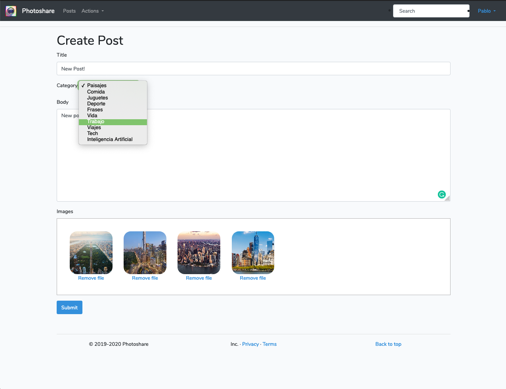
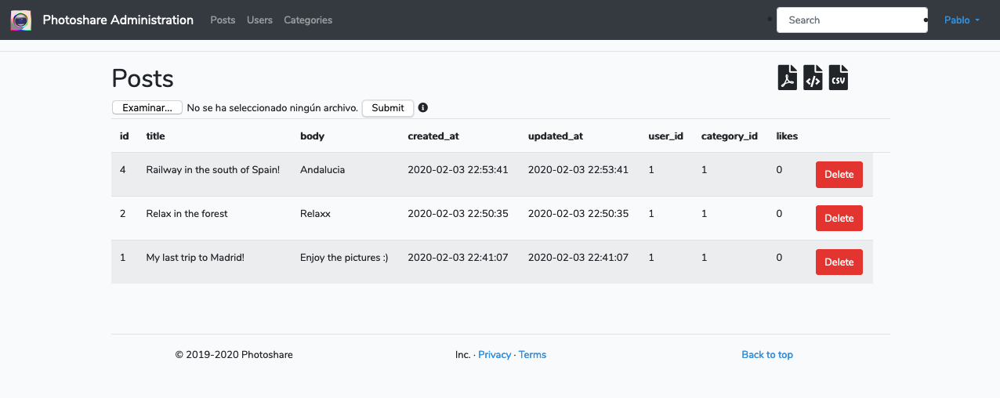

<h1 align="center">Welcome to photoshare 👋</h1>

# Photoshare

Photoshare is a social website. You are able to create your own posts. Write about whatever you want and to upload as many pictures as you want.

You can tell people you like their posts by giving a like.

## Stack used

- `Laravel`: Php framework Back-end
- `AWS S3 Bucket`: Cloud File System
- `Heroku`: Deploy
- `HTML, CSS & Javascript`: Front-end

## Features

Home screen with all posts with a search box.

Create post with several pictures

Visualization Post

Administration Panel to handle Posts Users and Categories

# Author
## Pablo Ospino Sánchez.

> The goal of this little project was to learn laravel and be able apply it into a real project.

## License

The Laravel framework is open-source software licensed under the [MIT license](https://opensource.org/licenses/MIT).

## Show your support

Give a ⭐️ if this project helped you!

***
_This README was generated with ❤️ by [readme-md-generator](https://github.com/kefranabg/readme-md-generator)_
